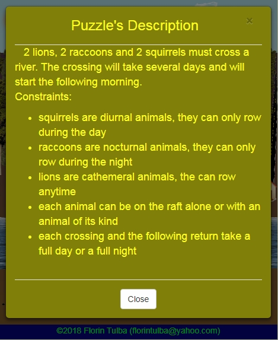

### Describing and solving [River Crossing Puzzles](https://en.wikipedia.org/wiki/River_crossing_puzzle)

* * *

This type of puzzles requires moving several people / animals / goods (*entities*) from one bank of a river to the other bank using a raft / bridge.

Each problem comes with various constraints, like:

* which / how many entities are allowed to cross the river at once
* which / how many entities should remain on each bank
* a time limit for getting all entities to the other side, based on the speed of every required crossing of the river

Below are several such scenarios whose solutions are visualized as web pages (functional for mobile devices, as well). The first column presents the puzzle description and the other 2 columns show various stages of the animated solutions. The second column illustrates the `portrait` orientation (when the height of the view is larger than the width), while the third column shows what appears in `landscape` views (width larger than height).

|                                          Description                                          |                           Portrait view                            |                            Landscape view                            |
| :-------------------------------------------------------------------------------------------: | :----------------------------------------------------------------: | :------------------------------------------------------------------: |
|  |   |     |
|         |                |                  |
|      |  |  |
|                                           |                       |                         |

One visualization like this **might be examined** opening [html/viewSolution.html](https://raw.githack.com/FlorinTulba/RiverCrossing/5f3731a6/html/viewSolution.html).

Folder [Scenarios](./Scenarios/) contains the puzzles used for testing in *json* format.

Each puzzle file contains a description of the problem.

The entities should appear as follows:
```
"Entities" : [
    {"Id": <entity id - mandatory>,
    "Name": <entity name - mandatory>,
    "Type": <entity type - optional>,
    "CanRow": <boolean expression - optional; default: false; same as CanTackleBridgeCrossing>,
    "StartsFromRightBank": <boolean - optional; default: false>,
    "Weight": <entity weight - optional>,
    "Image": <details for an image of this entity, used when simulating the solution - optional>},
    
    ... - other entities
    ]
```

Below are the possible specifiers for the constraints related to crossing the river. There must appear at least one such constraint.
```
"CrossingConstraints" : {
    "RaftCapacity": <max entities on the raft at once - optional ; Same as BridgeCapacity>,
    "RaftMaxLoad": <max weight supported by the raft - optional ; Same as BridgeMaxLoad>,
    "AllowedRaftConfigurations": <id-s of the entities that can use together the raft - optional ; Same as AllowedBridgeConfigurations>,
    "DisallowedRaftConfigurations": <id-s of the entities that cannot use alone the raft - optional ; Same as DisallowedBridgeConfigurations>,
    "CrossingDurationsOfConfigurations": [ several items like: "<crossing duration> : <configurations separated by ; > ] - optional information",
    "AllowedRaftLoads": <alternatives of total loads allowed on the raft during a given crossing - optional ; Same as AllowedBridgeLoads>
    }
```

These are the specifiers for the constraints for each river bank:
```
"BanksConstraints" : {
    "AllowedBankConfigurations": <id-s of the entities that can remain alone on any bank - optional>,
    "DisallowedBankConfigurations": <id-s of the entities that cannot remain alone on any bank - optional>
    }
```

Sometimes, some other constraints are needed:
```
"OtherConstraints" : {
    "TimeLimit": <max duration for transfering all entities to the other bank - optional>,
    "NightMode": <selects which solution steps happen during the night; boolean expression - optional; default: false>,
    }
```

The scenarios use the following conventions:

- the first crossing starts always from the left bank
- a boolean expression is ```true```, ```false``` or an expression that evaluates to a boolean, optionally prefixed by ```if```
- ```%...%``` is for dynamic expressions. **%CrossingIndex%** is the 1-based index of the current step / move / crossing; **%PreviousRaftLoad%** is the value of the raft load during the previous crossing (undefined for the first crossing)
- ```;``` delimits alternative expressions: 0 12 ; 3 14 5 which says that 0 12 and 3 14 5 are both valid configurations
- ```|``` delimits alternatives within an expression: 13 (24 | 5) which means that 13 24 and 13 5 are valid expressions
- ```...``` allows accepting any number of the remaining entities: 13 ... stands for 13 ; 13 0 ; 13 0 1 ; 13 0 1 2 ; 13 0 1 2 3 ; a.s.o.
- a ```!``` prefix denotes the lack of the prefixed entity: 22 4 !18 ... which means that 22 4 are expected and there might be other entities apart from 18
- a ```?``` suffix denotes an optional entity: 32 14? 48 which reads that 32 48 and 32 14 48 are valid expressions
- ```*``` allows any entity apart from the ones mentioned within the current expression: 10 2 * denotes 10 2 0 ; 10 2 1 ; 10 2 3 ; 10 2 4 ; a.s.o.
- ```-``` is used to unqualify all entities (the empty set)
- ```3+ x employee + 2 x manager + 10- x visitor + child``` means at least 3 entities of type employee, exactly 2 entities of type manager, at most 10 visitors and exactly 1 child
- ```v1..v2``` defines the v1-v2 range
- ```add(v1, v2)``` means v1 + v2
- ```v mod n``` is the remainder of v divided by n
- ```v [not] in {values}``` is true if v is [not] among values

The fictitious scenario from below covers the syntax used so far:
```
{"ScenarioDescription": [],
"Entities" : [
    {"Id": 0,
    "Name": "JohnDoe",
    "Type": "employee",
    "Weight": 82,
    "CanRow": "if (%CrossingIndex% mod 3) in {1, 2}",
    "StartsFromRightBank": true},

    {"Id": 1,
    "Name": "Jane",
    "Type": "manager",
    "Weight": 45},

    {"Id": 2,
    "Name": "Vincent",
    "CanRow": true,
    "Type": "visitor",
    "Weight": 75},

    ... - several other entities with id-s starting from 3
    ],

"CrossingConstraints" : {
    "RaftCapacity": 2,
    "RaftMaxLoad": 160,
    "AllowedRaftLoads": "add(%PreviousRaftLoad%, -10) .. add(%PreviousRaftLoad%, 10)",
    "CrossingDurationsOfConfigurations": [
        "10 : 0 1? ; 5",
        "20 : (2 | 3 | 4) (0 | 1)?",
        ... - remaining possible configurations with their durations
        ],

    !!! Use at most one of the AllowedRaftConfigurations and DisallowedRaftConfigurations
    !!! Below they appear both, just to exemplify more cases
    "AllowedRaftConfigurations": "* ; 2 x employee ; 2 x manager ; employee + visitor ; 0 1",
    "DisallowedRaftConfigurations": "0 (4 | 5)? ; 3 (1 | 2 | 6) ; 1 * ; 4 * ; 2 6"
    },

"BanksConstraints" : {
    !!! Use at most one of the AllowedBankConfigurations and DisallowedBankConfigurations
    !!! Below there appear more of them, just to exemplify more cases
    "AllowedBankConfigurations": "0 1 ; 0 (3 | 4 | 5) !1 ... ; 2 !3 * ...",
    "DisallowedBankConfigurations": "1 (0 | 2) ; 4 (3 | 5) ; 3 x employee + 2 x manager ; 2+ x employee + manager",
    "DisallowedBankConfigurations": "1+ x employee + 0 x manager + 1+ x visitor"
    },

"OtherConstraints" : {
    "TimeLimit": 1000,
    "NightMode": "if (%CrossingIndex% mod 3) in {0}"
    }
}
```
Explanations of the example scenario:

- there are 3 types of entities: *employee*, *manager* and *visitor*
- every third crossing (third, sixth, ninth ...) happen during the night shift ```NightMode if (%CrossingIndex% mod 3) in {0}```
- the employee JohnDoe who weighs 82kg is initially on the other bank (the right one, so at the end he needs to be on the left bank). He can row, but won&#39;t row during the night - every third crossing (third, sixth, ninth ...): ```CanRow if (%CrossingIndex% mod 3) in {1, 2}```
- the manager Jane weighs 45kg and cannot row
- the visitor Vincent weighs 75kg and can row (without restrictions)
- the raft supports a maximum load of 160kg and carries only 2 passengers at once. Besides, any consecutive raft loads cannot vary with more than 10kg: ```AllowedRaftLoads add(%PreviousRaftLoad%, -10) .. add(%PreviousRaftLoad%, 10)```
- every person needs to reach their target bank in under 1000s
- it takes 10s for employee JohnDoe (id 0) to cross the river alone or together with the manager Jane (id 1). Entity with id 5 needs 10s as well for the traversal: ```CrossingDurationsOfConfigurations 10 : 0 1? ; 5```
- it takes 20s for the persons with the id-s 2, 3 or 4 to cross the river alone or together with either JohnDoe (id 0) or Jane (id 1): ```CrossingDurationsOfConfigurations 20 : (2 | 3 | 4) (0 | 1)?```
- the raft can be used by any person (who can row) or by 2 employees, or by 2 managers, or by an employee and a visitor or by the persons with id-s 0 and 1: ```AllowedRaftConfigurations * ; 2 x employee ; 2 x manager ; employee + visitor ; 0 1```
- the raft cannot be used by the persons with id-s 0 alone or together with 4 or 5, neither by 3 together with 1, 2 or 6. Furthermore, 1 and 4 must row alone on the raft and 2 and 6 cannot use the raft simultaneously: ```DisallowedRaftConfigurations 0 (4 | 5)? ; 3 (1 | 2 | 6) ; 1 * ; 4 * ; 2 6```
- at a given time, on any bank there can be together either people with id-s 0 and 1, or 0 with one of 3, 4 or 5, but without 1, plus any number of the remaining people. Finally, an acceptable configuration is also 2, without 3, plus at least one of the remaining persons: ```AllowedBankConfigurations 0 1 ; 0 (3 | 4 | 5) !1 ... ; 2 !3 * ...```
- do not leave alone on a bank following people: 1 with either 0 or 2; 4 with either 3 or 5 and neither more employees than managers: ```DisallowedBankConfigurations 1 (0 | 2) ; 4 (3 | 5) ; 3 x employee + 2 x manager ; 2+ x employee + manager```
- make sure visitors are not together with the employees in the absence of managers: ```DisallowedBankConfigurations 1+ x employee + 0 x manager + 1+ x visitor```

- - -

The program will signal scenarios that are either trivial or unfeasible. Examples of such scenarios:

- when all entities can board the raft at once and thus perform a single crossing
- when the raft can hold only a single entity. Such an entity will cross the river just to realize it must cross the river back to return the raft. Situations like that prevent any progress towards a solution
- when no entity from the starting bank can row

So, valid scenarios come with a raft that can hold at least 2 entities. The total number of entities must be larger than the raft capacity. Furthermore, some entities from the starting bank should be able to row.

The raft / bridge capacity might be deduced or reduced based on several different provided constraints, like the max load or the (dis)allowed raft / bridge configurations.

- - -

The minimum C++ standard for the project is *c++20* and the libraries [*Boost*](https://www.boost.org) (version &ge; 1.67) and [*Microsoft GSL*](https://github.com/microsoft/GSL) (version &ge; 4.0) should be installed.
After installing them, follow the instructions from [*./dev/*](./dev/) folder for providing the relevant data about these libraries to the project.
*Boost.Test* library is needed for the unit tests only.
The shared version of it was [built](https://www.boost.org/doc/libs/1_87_0/libs/test/doc/html/boost_test/adv_scenarios/build_utf.html) for each combination of platform and compiler of interest when not found already in repositories.

On following OS-s/platforms these are the compilers used to build and test the project:

|                        OS/Platform                        |                                 GCC                                  |                             Clang                             |                             MSVC                             |
| :-------------------------------------------------------: | :------------------------------------------------------------------: | :-----------------------------------------------------------: | :----------------------------------------------------------: |
|                         MacOS 15                          |                                 14.2                                 |             16<br><small>*(Apple Clang)*</small>              |                                                              |
|                       FreeBSD 14.2                        |                                 14.2                                 |                             19.1                              |                                                              |
| Android 8<br><small>using *Termux* from *F-Droid*</small> | <small>*GCC is actually Clang.<br>No separate GCC available*</small> |                             19.1                              |                                                              |
|          Debian 12.9<br><small>*32-bit*</small>           |                                 12.2                                 |                                                               |                                                              |
|                      Linux Mint 22.1                      |                                 14.2                                 |                             19.1                              |                                                              |
| Ubuntu 24.04<br><small>from *WSL2* in Windows 11</small>  |                                 14.2                                 |                             19.1                              |                                                              |
|   MinGW64<br><small>from *MSYS2* in Windows 11</small>    |                                 14.2                                 |                             19.1                              |         <small>*can run MSVC-generated code*</small>         |
|    UCRT64<br><small>from *MSYS2* in Windows 11</small>    |                                 14.2                                 |                             19.1                              |         <small>*can run MSVC-generated code*</small>         |
|   Clang64<br><small>from *MSYS2* in Windows 11</small>    |                                 13.3                                 |                             19.1                              |         <small>*can run MSVC-generated code*</small>         |
|          Cygwin<br><small>in Windows 11</small>           |                                 12.4                                 | <small>*Clang from Cygwin is<br>no longer maintained*</small> |         <small>*can run MSVC-generated code*</small>         |
|                        Windows 11                         |                                                                      |                                                               | <small>Platform Toolset v143<br>(Visual Studio 2022)</small> |

The provided [Makefile](./Makefile) and Visual Studio project files allow generating the binaries for the release / debug and for the unit tests.
The executables can then be launched using the corresponding *run&lt;Configuration&gt;.(sh|bat)* command.
A valid RiverCrossing scenario in JSON format should be provided to the standard inputs of the release / debug versions immediately after launching. For this, you may pick the contents of any file from the [./Scenarios/](./Scenarios/) folder.

Below is a selection of the output generated by the unit tests in Cygwin using runTests.sh &lt;*pathToBoostTestLibFolder*&gt;, where the parameter is needed only for *.exe* files (from MSYS/Cygwin/MSVC builds):

```
Running 183 test cases...
Platform: Cygwin
Compiler: GNU C++ version 12.4.0
STL     : GNU libstdc++ version 20240620
Boost   : 1.87.0
Entering test module "RiverCrossing_tests"
.........................................
Leaving test module "RiverCrossing_tests"; testing time: 2266815us

Test module "RiverCrossing_tests" has passed with:
  183 test cases out of 183 passed
  1968 assertions out of 1968 passed
```

The solutions are provided either using a Breadth-First search (BFS - the default and optimal strategy), or they can be generated with a Depth-First (DFS) approach.

The [./GoServer/](./GoServer/) folder offers support to describe/modify RiverCrossing scenarios and visualize their solutions in an interactive fashion, not just from a console. 
It requires [*Golang*](https://go.dev/) installation and extending PATH (if necessary) with the folder containing the *go[.exe]* program.

The scripts *./startWebServer.(sh|bat)* will compile and launch the server and [http://localhost:8080/RiverCrossing](http://localhost:8080/RiverCrossing) is the page to open for playing around with possible scenarios and checking their solutions.

When the scenario doesn&#39;t specify a valid image for a certain entity, the browser will display the name of that entity as the alternative text.
Property `Image.Url` (of an entity) points to the desired image;
`Image.Origin` [optional] is used to specify where from a certain image file was copied (before using it as it was or adapting it);
`Image.Size` [optional] is a property taking small negative integer values or 0 - 0 means displaying the largest size of the image, -1 means a little smaller, -2 even smaller a.s.o.
This helps differentiating among similar looking entities, for instance the single entity able to row from a scenario might appear as the largest.
At the other end, the cabbage (from the puzzle mentioned right below) might need to appear rather small compared to the animals and the farmer.

Here is the console output for the classical [*Farmer - Wolf - Goat - Cabbage*](./Scenarios/wolfGoatCabbage.json) puzzle:

```
Handling scenario file: "Scenarios\wolfGoatCabbage.json"
Entities: [ Entity 0 {Name: `Farmer`, CanRow: `true`}, Entity 1 {Name: `Wolf`}, Entity 2 {Name: `Goat`}, Entity 3 {Name: `Cabbage`} ]
CrossingConstraints: { Capacity = 2 }
BanksConstraints = NOT{ [ Mandatory={2 extra_ids_count=1} Avoided={0} any_number_from_the_others ] }

Found solution using 7 steps:
Left bank: [ Farmer(0), Wolf(1), Goat(2), Cabbage(3) ] ; Right bank: [] ; Next move direction:  -->

        move   1:       >>>> [ Farmer(0), Goat(2) ] >>>>

Left bank: [ Wolf(1), Cabbage(3) ] ; Right bank: [ Farmer(0), Goat(2) ] ; Next move direction:  <--

        move   2:       <<<< [ Farmer(0) ] <<<<

Left bank: [ Farmer(0), Wolf(1), Cabbage(3) ] ; Right bank: [ Goat(2) ] ; Next move direction:  -->

        move   3:       >>>> [ Farmer(0), Cabbage(3) ] >>>>

Left bank: [ Wolf(1) ] ; Right bank: [ Farmer(0), Goat(2), Cabbage(3) ] ; Next move direction:  <--

        move   4:       <<<< [ Farmer(0), Goat(2) ] <<<<

Left bank: [ Farmer(0), Wolf(1), Goat(2) ] ; Right bank: [ Cabbage(3) ] ; Next move direction:  -->

        move   5:       >>>> [ Farmer(0), Wolf(1) ] >>>>

Left bank: [ Goat(2) ] ; Right bank: [ Farmer(0), Wolf(1), Cabbage(3) ] ; Next move direction:  <--

        move   6:       <<<< [ Farmer(0) ] <<<<

Left bank: [ Farmer(0), Goat(2) ] ; Right bank: [ Wolf(1), Cabbage(3) ] ; Next move direction:  -->

        move   7:       >>>> [ Farmer(0), Goat(2) ] >>>>

Left bank: [] ; Right bank: [ Farmer(0), Wolf(1), Goat(2), Cabbage(3) ]
```

When no solution is found, like when setting maximum raft load to 99 instead of 100 for the [familiy with a bag](Scenarios/familyAndBag.json), the console displays this information:

```
Considered scenario:
Entities: [ Entity 0 {Name: `Father`, Weight: 90, CanRow: `true`}, Entity 1 {Name: `Mother`, Weight: 80, CanRow: `true`}, Entity 2 {Name: `Boy`, Weight: 60, CanRow: `true` ] Entity 3 {Name: `Girl`, Weight: 40, CanRow: `true`}, Entity 4 {Name: `Bag`, Weight: 20}
CrossingConstraints: { Capacity = 2; MaxLoad = 99 }

Found no solution. Longest investigated path: 3. Investigated states: 10. Nearest states to the solution:
[ Father(0), Mother(1), Girl(3) ] - [ Boy(2), Bag(4) ]
[ Father(0), Mother(1), Boy(2) ] - [ Girl(3), Bag(4) ]
[ Mother(1), Boy(2), Girl(3) ] - [ Father(0), Bag(4) ]
[ Father(0), Boy(2), Girl(3) ] - [ Mother(1), Bag(4) ]
```

- - -

The [bridge and torch problem](./Scenarios/bridgeAndTorch.json) is from [Wikipedia](https://en.wikipedia.org/wiki/Bridge_and_torch_problem). The puzzle [parents with 4 children, a policeman and a thief](./Scenarios/parents4ChildrenCopAndThief.json) is from [here](http://www.japaneseiqtest.net/). The rest of the puzzles from the [Scenarios](./Scenarios/) folder are from a [River Crossing game](https://play.google.com/store/apps/details?id=com.androyal.rivercrossing.complete) from Google Play Store.

* * *

&copy; 2018-2025 Florin Tulba (florintulba@yahoo.com)
